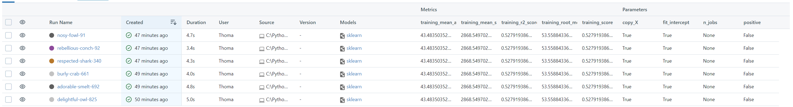
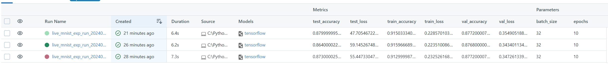

# De DevOps à MLops : Quelle place pour MLFlow ?

## Auteurs

Nous sommes quatre étudiants en M2 ou en dernière année de Polytech' Nice-Sophia spécialisé en architecture logicielle :

* Thomas FARINEAU &lt;thomas.farineau@icloud.com&gt;
* Léo KITABDJIAN &lt;leo.kitabdjian@etu.univ-cotedazur.fr&gt;
* Ludovic BAILET &lt;ludovic.bailet@etu.univ-cotedazur.fr&gt;  (on ne sait pas ou il est...)
* Mohamed MAHJOUB &lt;mohamed.mahjoub@etu.univ-cotedazur.fr&gt;

## I. Contexte de recherche
La question de la gestion des expériences dans MLflow touche le cœur du MLOps, mettant en lumière son rôle dans l'amélioration de la qualité, rapidité et fiabilité du développement des modèles de machine learning. Cette approche permet d'identifier des pratiques optimales pour mener des expériences en ML, cruciales pour le progrès dans ce secteur. Le MLOps, équivalent du DevOps dans le domaine du ML, est indispensable pour les organisations désireuses d'accélérer et sécuriser leurs initiatives d'apprentissage automatique.  
Avec l'adoption croissante d'outils de MLOps par des plateformes comme Azure, il est évident que l'intégration et la gestion des expériences deviennent une priorité pour assurer le succès des projets en intelligence artificielle.

## II. Observations et questions générales
L’objectif de ce projet d’étude est de pouvoir comprendre quels sont les besoins liés à la traçabilité des expériences de Machine Learning.

Nous considérons la définition suivante pour “traçabilité” pour le reste de ce chapitre :
-   Stocker les données liées aux expériences dans le but de suivre leur évolution et les consulter.

Suite aux observations effectuées sur l'émergence récente de MLOps, il est donc encore plus important désormais de garantir la traçabilité de MLFlow pour garantir la capacité à retracer et centraliser des expériences qui peuvent être nombreuses et issues de plusieurs collaborateurs.  
On retrouve aussi des principes inclus au premier abord, similaires aux principes retrouvés en DevOps avec du Versioning, du Logging. Cependant il y’a tout de même des forts coût de compatibilités au niveau de l'intégration continue de projets de machine learning ce qui représente un risque
Suite à ces observations, afin de répondre à la question principale, il nous a paru important de pouvoir répondre au sous questions suivantes :  
-   Quels sont les principes nécessaires à la traçabilité des expériences de machine learning et s'inscrivent-ils dans une logique de reproductibilité des expériences ?
-   Quels sont les besoins liés à la traçabilité des expériences de ML ?
-   Quels sont les principes DevOps utilisés pour tracer les expériences de ML et y en a-t-il d'autres ?

## III. Collecte d'informations

### Articles

La documentation MLflow offre des informations sur la configuration et l'utilisation de MLflow pour la collecte de données d'expérimentation en machine learning.

- [Documentation MLFlow](https://mlflow.org/docs/latest/)  
  **Type de document :** Documentation  
  **Résumé :**  
  La documentation de MLflow décrit les fonctionnalités et composants clés pour gérer le cycle de vie des projets de machine learning, y compris le suivi des expériences, la gestion des modèles, la préparation et le déploiement. Elle offre des guides pour démarrer, intégrer MLflow avec d'autres outils et plateformes, et des conseils pour la meilleure utilisation dans différents scénarios d'application.

### Jeux de données
- scikit-learn  
  Afin d’effectuer des tests, on utilise les jeux de données offerts par scikit-learn.
- [Topic GitHub mlflow-projects](https://github.com/topics/mlflow-project)   
  L'objectif principal est de vérifier si les projets Git utilisant MLFlow documentent l'implémentation de la traçabilité en mentionnant spécifiquement `mlflow.log_params`. Cela détermine leur conformité aux bonnes pratiques de documentation des expérimentations en machine learning, essentielles pour la reproductibilité et la comparaison des performances des modèles.

### Outils

- Création d'un outil permettant d'analyser un grand nombre de projets utilisant MLflow et de vérifier l'existence de `mlflow.log_params`.
- MLFlow
- Jupyter Notebook

## IV. Hypothèse et expériences

### Bifurcation de sujet
Il est important de noter que toutes les semaines où nous avons eu des TD, on nous a imposé de passer à une autre sous-question, alors que celle que nous avons étudiée avait été préalablement “validée”. Cela signifie donc que nous avons dû commencer par la première sous-question concernant la reproductibilité, puis ensuite aborder la sous-question qui traite de l'impact de la traçabilité sur la reproductibilité, pour enfin nous orienter vers les besoins liés à la traçabilité dans les expériences de machine learning. En conséquence, la plupart des expériences que nous avions envisagées au début du projet, ainsi que les hypothèses formulées initialement, sont devenues obsolètes. À partir de là, nous avons dû à chaque fois reprendre d'autres hypothèses jusqu'à arriver à la proposition présentée ci-dessous.

### Hypothèses

1. Hypothèse 1 : MLFlow facilite la reproductibilité grâce aux metriques  
   L'utilisation de MLFlow améliore significativement la reproductibilité des expériences de machine learning en permettant une traçabilité complète des processus. En enregistrant méticuleusement chaque étape, de la préparation des données au choix des algorithmes, en passant par les paramètres du modèle et les environnements d'entraînement, MLFlow offre une transparence totale. Cette documentation détaillée facilite la validation et l'itération des expériences, contribuant à l'amélioration de la qualité et de la fiabilité des modèles de ML. L'hypothèse suggère que grâce à cette traçabilité, les chercheurs et les développeurs peuvent reproduire des résultats avec plus de précision, favorisant ainsi une recherche plus rigoureuse et des développements plus efficaces dans le domaine du machine learning.

### Expériences

1.  Expérience 1 : Exécutabilité visant la reproductibilité

Dans une première phase, nous avons concentré nos efforts sur l'exécutabilité, avec pour objectif de permettre le redémarrage d'une expérience via MLFlow, tout en préservant les paramètres initiaux. Pour aborder et tester notre première hypothèse liée à la reproductibilité découlant de la traçabilité imposée dans le déroulement de l'expérience, nous avons exécutés des notebooks Jupyter spécifiques.

Ainsi, l'observation des métriques, qui se révèlent identiques à chaque test, pourrait nous amener à présumer que la reproductibilité est garantie. Cependant, une attention particulière doit être accordée au jeu de données utilisé. Prenons, par exemple, le projet disponible à l'adresse suivante :  
[https://github.com/at0m-b0mb/Mlflow-TensorFlow-Image-Classification-Guide](https://github.com/at0m-b0mb/Mlflow-TensorFlow-Image-Classification-Guide)
Une analyse approfondie, après trois lancements, révèle que les métriques subissent de légères variations.

On en conclut que MLFlow n’assure aucune reproductibilité dans cette expérience, ce qui, en fait, est logique puisque de manière générale, quand on exécute un programme de machine learning sur un ordinateur, même si on lui met les mêmes paramètres, il arrive très souvent que les résultats diffèrent puisque l'exécution dépend de nombreux facteurs qui peuvent varier. Ces facteurs incluent l'initialisation aléatoire des poids dans les modèles de machine learning, la sélection des échantillons lors de la division en ensembles d'entraînement et de test si elle n'est pas contrôlée à 100%, ainsi que les spécificités de l'environnement d'exécution telles que la version des bibliothèques utilisées, la configuration matérielle, et même l'ordonnancement des opérations par le processeur, qui peut affecter les calculs en virgule flottante.

MLflow, en tant qu'outil, n'est pas conçu pour garantir que les résultats d'une exécution de modèle seront identiques à chaque exécution mais plutôt, c’est de fournir un cadre pour la traçabilité et la gestion du cycle de vie des modèles de machine learning. Il permet aux développeurs de suivre les paramètres, les métriques et les artefacts associés à chaque exécution, facilitant ainsi la comparaison des expériences et la compréhension des conditions sous lesquelles les résultats ont été obtenus.

## V. Résultat d'analyse et conclusion

## VI. Outils

- Outils utilisé pour l'expérience 1
  - [Notebook Jupyter Experiment 1](./assets/basic_experiment.ipynb)
  - [Notebook Jupyter Experiment 2](./assets/complexe_experiment.ipynb)  
  Les buts de ces notebooks sont de reproduire facilement les résultats obtenus lors de l'expérience 1.

## VI. References

[Debret 2020] Debret, J. (2020) La démarche scientifique : tout ce que vous devez savoir ! Available at: https://www.scribbr.fr/article-scientifique/demarche-scientifique/ (Accessed: 18 November 2022).
[https://ml-ops.org/content/references.html](https://ml-ops.org/content/references.html)
[https://mlflow.org/docs/latest/](https://mlflow.org/docs/latest/)
